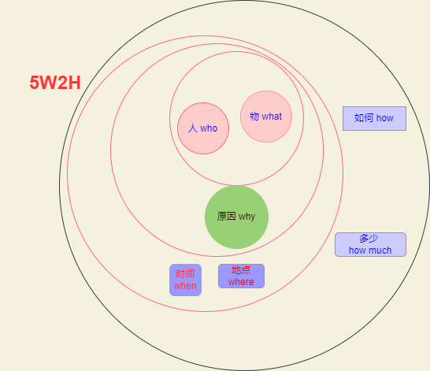

# 写作技巧

## 5w2h

## 画图

[程序员画图](https://dandelioncloud.cn/article/details/1537670575246131202)
图形： 长方形、正方形、菱形、圆形、三角形、气泡、箭头、常用logo

颜色： 色块优先选择：红、绿、黄、蓝，实在不够用了才会选择：橙、青、紫。白色背景，黑色线条和文字，默认字体

颜色值：  [color treand](https://coolors.co/palettes/trending)

红： #EC5D57
绿： #70BF41
蓝： #51A7F9
黄： #F5D328
紫： #B36AE2
橙： #F39019
青： #00E5F9

大小： 12列，每列80px, 宽度960px, 大小选择 A4。导出时选择边框距离为80px。

